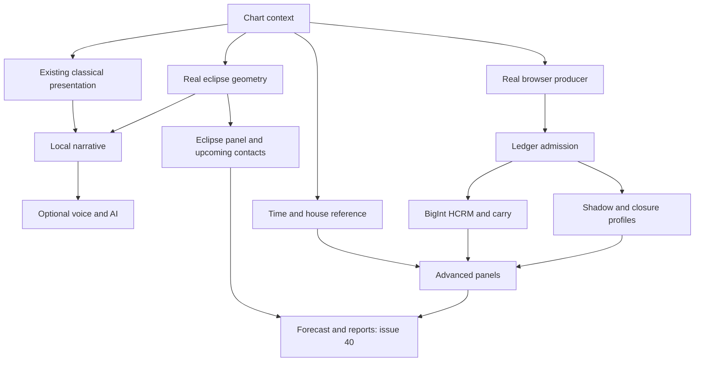

# Existing-system reading integration

Baseline: `26dc55715668a6718be2997833fc29059c8a82d2`.

## System blueprint

| Layer | Existing implementation | Integration contract |
| --- | --- | --- |
| Chart presentation | `app.jsx`, `astro.jsx`, `src/present/astro-core.js` | Classical positions, houses and readings stay first. Existing fallback notices remain visible. |
| Eclipse geometry | `eclipses.js`, `eclipse-view.jsx` | Prenatal solar/lunar pair, lifetime contacts, upcoming events and coordinate basis. Contact targets now use real engine longitudes, excluding unsupported synthetic bodies. |
| Time | `tools/ephemeris/timescale.js`, `houses.js` | Advanced Time Basis displays house-solver reference values with units and approximation labels. Planet positions retain Astronomy Engine's own time basis. |
| Producer | CLI `produce-ledger.mjs`; browser `browser-ledger.js` | Browser adapter computes ten real geocentric planets, rounds to integer arcseconds and hashes the same provenance payload as the CLI. It never converts synthetic chart floats into admitted entries. |
| Ledger | `src/ledger/import-ledger.js` | Every entry passes `admitForCore()` before diagnostics. Batch epoch must match the chart. |
| Core | `hcrm-core.js`, `shadow-spine.js`, `ring.js`, `rho.js`, `carry.js` | Existing BigInt computations remain unchanged. Outputs cross into presentation as decimal strings. |
| Reading adapter | `src/present/enhanced-reading.js` | Named eclipse contacts, per-placement register/carry/events and separate division shadow/closure profiles. |
| Narrative and voice | `narrative.jsx`, `session.jsx`, existing voice modules | Prenatal eclipse segment is composed locally, memoized independently of agent responses and included in character-offset synchronization. |
| Advanced UI | `enhanced-reading-view.jsx` | Optional time and HCRM disclosures. Diagnostic requests begin when opened; results are bound to chart identity and cancelled on changes. |
| Product completion | Issues #39 and #40 | Universal entry/local chart library; forecast calendars, comparative synastry, follow-ups, report composition and privacy audit. |

## Consumers

`buildDiagnostics(entries, dateISO)` validates the whole batch before evaluating registers. It returns `status`, `registers` (register, events, carry) and `divisions` (separate shadow and closure objects). The current browser caller generates entries directly; this is not an arbitrary-ledger upload interface or a claim of independent certificate authentication.

`natalEclipseText(engine, chart, orbDeg)` returns locally composed prenatal text. `eclipseReading(record, chart)` names only the supplied contacts and omits houses when time is unknown or polar angles are unsupported. Both use existing eclipse geometry. Above-horizon status remains a necessary condition, not a claim of local eclipse visibility.

`buildTimeBasis(chart)` exposes seconds for ΔT and degrees for GMST, GAST, obliquity and local apparent sidereal time. These describe the house solver's reference computation. The actual requested/selected house system remains visible, alongside existing chart fallback notices. Unknown time suppresses local orientation and house metadata and labels the assumed epoch.

## Scope and continuation

- Core modules, classical roles, AI opt-out and voice controls remain in place.
- The producer supplies planetary registers only. Admitted house/angle ledgers remain available through the CLI; browser admission of those is a future extension.
- The shadow band is attached to a named division. It is not assigned to a person or silently converted into a forecast intensity score.
- Transduction requires a source and target basis; this UI does not invent a transduction operation for a static chart.
- Upcoming eclipse contacts remain in the existing spread. Full calendar interaction, comparative diagnostics and report assembly belong to #40.
- Browser SHA-256 requires a secure context (HTTPS or localhost). Failure leaves classical readings usable and shows an unavailable diagnostic message.

## Verification

Focused tests compare browser longitudes/checksums to the CLI, reject malformed/synthetic/wrong-epoch input, distinguish shadow from closure, preserve unknown-time behavior, render the advanced tables, suppress stale results and verify narrative segment offsets. Run the repository full test, lint and claim-consistency gates before merging.
